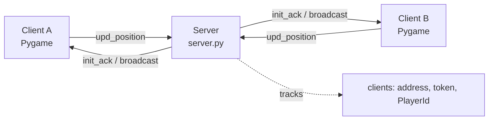

# UDP Multiplayer System

A lightweight multiplayer prototype built from scratch in Python — a UDP socket server, a custom JSON packet protocol, and a Pygame client that renders connected players as squares synced in real time.

No game engine, no external networking library — just raw sockets and a minimal protocol, built to understand (and demonstrate) how real-time multiplayer sync works under the hood.

---

## Features

- **Custom UDP protocol** — small, JSON-framed packet format for client/server communication
- **Token-based session identity** — clients authenticate with a per-session token; the server maps tokens to player IDs
- **Real-time position sync** — player movement is broadcast to all other connected clients
- **2D Pygame client** — renders your own player and every other connected player as a colored square
- **Client-side staleness detection** — players who go silent (disconnect, crash, or lose connection) are dropped locally after a timeout, since UDP has no built-in connection state

---

## Architecture



- The **server** is a single-threaded UDP listener. It has no persistent connections (UDP is connectionless) — instead it tracks known clients in memory, keyed by an auth token supplied by each client.
- Each **client** runs two things concurrently: a background thread that listens for incoming UDP packets (position broadcasts from other players), and a main thread running the Pygame loop (input, rendering, sending its own position).
- There is no authoritative game state beyond position — this is intentionally minimal, meant as a base to extend rather than a full game server.

---

## Protocol Specification

All packets are UTF-8 encoded JSON objects sent over UDP. Every request includes a `type` field.

| Type | Name              | Direction       | Payload                                              |
|------|-------------------|-----------------|-------------------------------------------------------|
| `0`  | `init_client`      | Client → Server | `{ "type": 0, "token": "<string>" }`                  |
| `1`  | `remove_client`     | Client → Server | `{ "type": 1, "token": "<string>" }`                  |
| `2`  | `upd_position`      | Client → Server | `{ "type": 2, "token": "<string>", "position": { "x": <int>, "y": <int> } }` |

**Server → Client messages:**

| Message              | Trigger                          | Payload                                              |
|-----------------------|-----------------------------------|-------------------------------------------------------|
| `init_ack`            | Response to `init_client`         | `{ "type": "init_ack", "playerId": <int> }`            |
| Position broadcast    | Another client sends `upd_position` | `{ "playerId": <int>, "pos": { "x": <int>, "y": <int> } }` |
| Generic ack           | Fallback for any other request    | `b"Recieved..."` (plain bytes, not JSON)               |

### Session flow

1. Client generates a random token and sends `init_client`.
2. Server assigns the client a `PlayerId`, stores `{address, auth_token, PlayerId}`, and replies with `init_ack`.
3. Client sends `upd_position` on movement (and periodically as a heartbeat — see [Known Limitations](#known-limitations)).
4. Server rebroadcasts the new position, tagged with the sender's `playerId`, to every other known client.
5. On clean exit, the client sends `remove_client`; the server removes it from the active client list. (This removal is **not** currently broadcast — see below.)

---

## Getting Started

### Prerequisites

- Python 3.10+ (avoid bleeding-edge versions like 3.14 until `pygame`/`pygame-ce` publish prebuilt wheels for them)
- [pygame-ce](https://pyga.me/) (recommended) or `pygame`

```bash
pip install pygame-ce
```

> If `pip install pygame` fails to build from source (common on very new Python versions on Windows), use `pygame-ce` instead — it's a drop-in, actively maintained fork with the same API and faster wheel releases.

### Running the server

```bash
python server.py
```

By default the server listens on `0.0.0.0:5083`. Edit the `server` tuple at the top of `server.py` to change the bind address/port.

### Running a client

```bash
python game_client.py
```

Set `SERVER_ADDR` at the top of `game_client.py` to point at the server's actual IP if not running locally. Launch multiple instances (or run on separate machines) to see multiple squares synced in real time.

**Controls:**

| Key            | Action        |
|----------------|---------------|
| `W` / `↑`      | Move up        |
| `S` / `↓`      | Move down      |
| `A` / `←`      | Move left      |
| `D` / `→`      | Move right     |
| `Esc`          | Quit           |

---

## Project Structure

```
.
├── server.py         # UDP server: session tracking, packet routing, broadcasting
├── game_client.py     # Pygame client: networking thread + render/input loop
└── README.md
```

---

## Configuration

| Variable                  | Location        | Default            | Description                                  |
|----------------------------|------------------|---------------------|-----------------------------------------------|
| `server`                    | `server.py`       | `("0.0.0.0", 5083)` | Bind address/port for the server              |
| `SERVER_ADDR`               | `game_client.py`   | `("127.0.0.1", 5083)` | Server address the client connects to        |
| `MOVE_SPEED`                | `game_client.py`   | `4`                 | Pixels moved per frame                         |
| `SEND_INTERVAL`             | `game_client.py`   | `0.05`              | Minimum seconds between outbound position packets |
| `STALE_TIMEOUT`             | `game_client.py`   | `5.0`               | Seconds of silence before a player is dropped locally |

---

## Known Limitations

This project is a protocol/networking demonstration first, a game second. Some deliberate simplifications:

- **No disconnect broadcast** — when a client sends `remove_client`, the server removes it internally but doesn't tell other clients. Clients currently infer disconnection from timeout (`STALE_TIMEOUT`), not an explicit event.
- **No movement heartbeat by default** — a client that stops sending updates (e.g. idle, no key presses) will eventually be pruned by other clients as "stale" even if it's still connected. Sending periodic idle heartbeats avoids this.
- **No packet loss/reliability handling** — UDP doesn't guarantee delivery or ordering. Position updates are fire-and-forget; a dropped packet just means a slightly stale position until the next one arrives.
- **No authentication beyond a client-generated token** — tokens aren't verified against anything; any client can claim any token. Not suitable for untrusted networks as-is.
- **Single-threaded server** — the server processes one packet at a time on the main thread. Fine for small player counts, but broadcasting is O(n) per update and will need batching/threading to scale.
- **No interpolation** — other players "teleport" between received positions rather than smoothly animating, since only raw coordinates are sent.

## Roadmap Ideas

- [ ] Broadcast explicit disconnect events instead of relying on client-side timeouts
- [ ] Add sequence numbers to detect and discard out-of-order position packets
- [ ] Interpolate remote player positions between updates for smoother movement
- [ ] Add basic token validation / reconnection handling
- [ ] Support custom player colors/usernames in the `init_client` payload

---

## Contributing

Issues and pull requests are welcome — this is meant as a learning/reference project for raw socket-based multiplayer networking, so contributions that improve protocol clarity, add tests, or extend the feature set are especially appreciated.

## License

Add your preferred license here (e.g. MIT).
